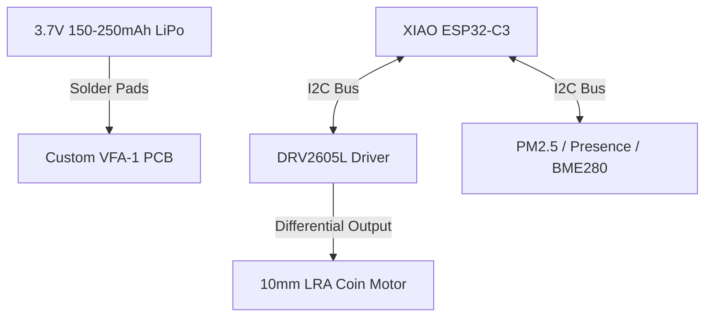

# Vibrational Field Agent (VFA-1) — Design Proposal & PCB Blueprint

*Document Version: 1.0 (Draft Concept)*  
*Repository Path: [Docs/VIBRATIONAL_AGENT.md](file:///c:/Users/seank/source/repos/Meridian/Docs/VIBRATIONAL_AGENT.md)*

This document outlines the conceptual design, locomotion physics, and PCB blueprint for the **Vibrational Field Agent (VFA-1)**—a low-complexity, self-repositioning environmental sensor node. By exploiting stick-slip physics via a Linear Resonant Actuator (LRA), the agent achieves directional movement on flat or textured surfaces without gears, motors, or wheels.

---

## 1. Locomotion Principle: Stick-Slip & Resonant Crawling

Unlike wheeled or legged robots, a vibrational crawling robot (or "vibrobot") moves by converting high-frequency internal oscillations into directional linear force through contact with a surface.

```mermaid
graph LR
    subgraph Locomotion Cycle
        A[Asymmetric LRA Pulse] -->|Fast Acceleration| B[Static Friction Overcome 'Slip']
        B -->|Slide Forward| C[Slow Deceleration]
        C -->|Friction Catches 'Stick']
        C -->|Net Forward Displace| A
    end
```

### Locomotion Mechanics
1. **Angled Fiber/Bristle Interface**: The underside of the agent's 3D-printed chassis features short, flexible, angled bristles or silicone pads. When the LRA vibrates, the bristles flex easily in one direction (slip) but resist and dig in when forced in the opposite direction (stick).
2. **Asymmetric Waveforms**: By using the **DRV2605L's Real-Time Playback (RTP)** mode, the microcontroller can feed asymmetric waveforms (e.g., a rapid sawtooth wave: sharp rise, slow decay). The sharp acceleration forces a "slip" phase, while the gentle decay lets the bristles reset without dragging the robot backward.
3. **Resonant Steering**: By mounting two LRAs off-axis or adjusting the vibration frequency to match the natural resonant frequency of the left or right chassis legs, the agent can achieve steering (differential vibration).

---

## 2. Hardware Stack & Integration

The VFA-1 reuses the exact micro-electronics stack validated during the Wrist-Puck build, allowing for immediate hardware translation.



### Component Selection
* **Microcontroller**: [Seeed Studio XIAO ESP32-C3](file:///c:/Users/seank/source/repos/Meridian/hardware/wrist_puck/wrist_puck_haptic_node/wrist_puck_haptic_node.ino) (runs BLE, WiFi, and the locomotion loop).
* **Haptic Driver**: [Adafruit DRV2605L](file:///c:/Users/seank/source/repos/Meridian/hardware/wrist_puck/WIRING.md) (controls LRA oscillation amplitude and frequency).
* **Actuator**: [10mm Linear Resonant Actuator (LRA)](file:///c:/Users/seank/source/repos/Meridian/hardware/wrist_puck/WIRING.md) (mounted off-center to amplify directional momentum).
* **Power Source**: Tiny 3.7 V LiPo battery (150–250 mAh to keep weight low—vibrobots scale down better than they scale up).
* **Chassis**: Lightweight 3D-printed enclosure with parametric angled legs/bristles printed on the **Bambu A1 Mini** using TPU (for springiness) or PLA.

---

## 3. PCB Blueprint & Schematic Routing (KiCad Guide)

To keep the robot small, light, and robust against vibrations, a custom PCB is highly recommended. The schematic below maps the connections for your first KiCad design:

```
                  +-------------------------+
                  |    XIAO ESP32-C3        |
                  |                         |
            GND --| [GND]             [5V]  |-- 5V VCC (from Charger)
          3.3V  --| [3V3]            [GND]  |-- Common GND
     (LBO pin)  --| [D0]             [3V3]  |
 (Presence INT) --| [D1]              [D5]  |-- I2C SCL (Yellow)
                  | [D2]              [D4]  |-- I2C SDA (Blue)
                  | [D3]             [TXD]  |
                  +-------------------------+
                    |  |               |  |
                    |  | (I2C Bus)     |  | (Power)
                    v  v               v  v
                  +-------------------------+
                  |      DRV2605L           |
                  |                         |
          3.3V  --| [VIN]            [OUT+] |-- LRA Coin Terminal A
        Common  --| [GND]            [OUT-] |-- LRA Coin Terminal B
       I2C SDA  --| [SDA]             [SCL] |-- I2C SCL
                  +-------------------------+
```

### Solder Pads for Sensors
The I2C lines (`SDA` and `SCL`) and `3.3V`/`GND` rails should break out to a 4-pin row of solder pads at the edge of the board. This allows you to chain various sensor modules:
1. **Human Presence Sensor** (e.g., LD2410 mmWave Radar via I2C or GPIO D1 interrupt).
2. **PM2.5 Sensor** (e.g., Plantower PMS5003 breakout).
3. **BME280** (Temperature, Humidity, Pressure).

---

## 4. Locomotion Code Sketch

To implement stick-slip locomotion, the firmware uses Real-Time Playback (RTP) mode on the DRV2605L. Below is a code concept for the main loop:

```cpp
#include <Wire.h>
#include <Adafruit_DRV2605.h>

#define SDA_PIN 6
#define SCL_PIN 7

Adafruit_DRV2605 drv;

void setup() {
  Wire.begin(SDA_PIN, SCL_PIN);
  drv.begin(&Wire);
  
  // Set DRV2605L to Real-Time Playback mode
  drv.setMode(DRV2605_MODE_REALTIME);
}

// Generates an asymmetric sawtooth waveform to drive stick-slip action
void stepForward(int stepDelayMs) {
  // 1. Sharp acceleration (slip phase)
  drv.setRealtimeValue(255); // Max amplitude forward
  delay(15);                 
  
  // 2. Slow decay (stick/reset phase)
  for (int amp = 200; amp >= 0; amp -= 25) {
    drv.setRealtimeValue(amp);
    delay(5);
  }
  
  drv.setRealtimeValue(0); // Cooldown
  delay(stepDelayMs);
}

void loop() {
  // Move forward 10 steps, then pause
  for(int i = 0; i < 10; i++) {
    stepForward(50);
  }
  delay(2000); 
}
```

---

## 5. Ecological Integration: The Autonomous "Pollen Pod"

Within the **Meridian distributed sensor ecology**, the VFA-1 acts as an active agent rather than a static listener:
* **Gradient Searching**: The agent can read light or presence values, executing small locomotion bursts to "creep" into direct sunlight to charge, or to position itself near human presence when active tracking is required.
* **Network Healing**: If a fixed sensor pod detects a communication drop, a nearby VFA-1 could be commanded via UDP/ESP-NOW to migrate closer to the relay point, serving as a dynamic wireless repeater.
* **Low Hardware Overhead**: No gears to jam, no exposed axles to gather dust or outdoor debris, and a tiny footprint that fits inside a pocket.

---

## 6. Steerable Morphology: The Inertial ERM Wiggler

Based on the inertial steering robot concept demonstrated by Pro Know, we can design an alternative steerable morphology using an **Eccentric Rotating Mass (ERM)** vibration motor and a bi-directional H-bridge driver.

### 6.1 Steering & Locomotion Physics
Rather than relying on angled bristles, the ERM wiggler uses rotational inertia and directional friction:

1. **Steer Left (CCW Pivot)**: Drive the ERM motor in **Reverse (CCW)**. The rotational inertia wiggles the chassis and pivots the legs counter-clockwise.
2. **Steer Right (CW Pivot)**: Drive the ERM motor in **Forward (CW)**. The opposite rotational inertia wiggles the chassis clockwise.
3. **Move Forward**: Rapidly alternate the motor polarity (e.g., CW for 40ms, CCW for 40ms). The rapid back-and-forth wiggling breaks static friction, and when balanced correctly with slightly flexible legs, drives the robot forward in a straight line.

```
       [Forward Path]
             ^
             |   (Rapid CW / CCW alternating wiggles)
        ~ ~ ~|~ ~ ~
       |     |     |
     (CCW)   |   (CW)
     Pivot  / \  Pivot
       <---/   \--->
```

### 6.2 Electronics Stack Adjustments
To support reversing the DC motor polarity, we swap the unidirectional driver requirements:
* **Driver**: Tiny H-bridge IC like the **DRV8212** or the **DRV8837C** (which have simple IN1/IN2 control pins and can handle the high stall current of small DC vibration motors).
* **Motor**: A standard **coreless DC vibration motor** (cylinder style with an off-center brass weight, typical in paging devices). *Note: LRAs cannot be driven this way as they are AC-only resonance devices.*
* **MCU**: Seed Studio XIAO ESP32-C3 or an ESP-01F module, running **ESP-NOW** for ultra-low latency direct wireless control from a bench remote or control node.

### 6.3 Code Concept: H-Bridge Polarity Alternator
This code snippet illustrates how to implement the straight-line shimmy and differential steering with a dual-pin H-bridge driver:

```cpp
#define IN1_PIN 2 // GPIO2 -> H-Bridge Input 1
#define IN2_PIN 3 // GPIO3 -> H-Bridge Input 2

void setup() {
  pinMode(IN1_PIN, OUTPUT);
  pinMode(IN2_PIN, OUTPUT);
  stopMotor();
}

void driveForward(int durationMs, int frequencyHz) {
  int periodMs = 1000 / frequencyHz;
  int halfPeriod = periodMs / 2;
  unsigned long start = millis();
  
  while (millis() - start < durationMs) {
    // Phase 1: CW spin
    digitalWrite(IN1_PIN, HIGH);
    digitalWrite(IN2_PIN, LOW);
    delay(halfPeriod);
    
    // Phase 2: CCW spin
    digitalWrite(IN1_PIN, LOW);
    digitalWrite(IN2_PIN, HIGH);
    delay(halfPeriod);
  }
  stopMotor();
}

void pivotLeft(int durationMs) {
  digitalWrite(IN1_PIN, LOW);
  digitalWrite(IN2_PIN, HIGH); // Constant CCW
  delay(durationMs);
  stopMotor();
}

void pivotRight(int durationMs) {
  digitalWrite(IN1_PIN, HIGH); // Constant CW
  digitalWrite(IN2_PIN, LOW);
  delay(durationMs);
  stopMotor();
}

void stopMotor() {
  digitalWrite(IN1_PIN, LOW);
  digitalWrite(IN2_PIN, LOW);
}

void loop() {
  // Drive forward for 2 seconds
  driveForward(2000, 15); 
  delay(500);
  
  // Pivot left (steer)
  pivotLeft(500); 
  delay(500);
}
```

