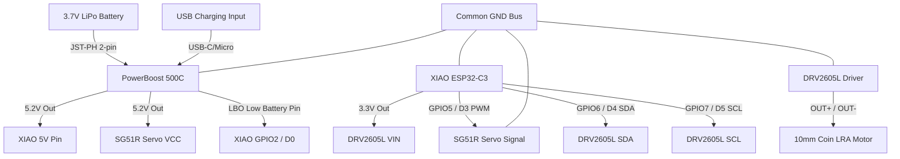

# Wrist-Puck Haptic Node (v1.0 Rev A) — Wiring Guide

*Document Version: 1.0 (Rev A Power Architecture)*  
*Repository Path: [hardware/wrist_puck](file:///c:/Users/seank/source/repos/Meridian/hardware/wrist_puck)*

This guide provides the complete physical wiring specifications, pin assignments, and power architecture for the **Embodied Judgment "Wrist-Puck" Haptic Node (v1.0 Rev A)**. 

---

## 1. Electrical Architecture Overview

The Wrist-Puck is a self-contained, battery-powered wearable haptic device. The **Rev A** power architecture simplifies the design by utilizing the **Adafruit PowerBoost 500C** as the single power management layer, regulating battery voltage to **5.2 V** for the servo and powering the **Seeed Studio XIAO ESP32-C3**.



### Key Features of Rev A Power
* **Elimination of Boost Converter Fork:** The PowerBoost 500C boosts the battery voltage to **5.2 V**, providing full rated torque to the **SG51R servo** directly from the battery rail.
* **Low Battery Output (LBO):** Replaces the legacy `100kΩ/100kΩ` analog voltage divider. The PowerBoost's LBO pin pulls **LOW** when the LiPo drops below **3.2 V**, providing a clean digital signal directly to **GPIO2**.

---

## 2. Component Pin Mapping

Refer to this table when preparing your jumper wires and perfboard routing:

| Signal Name | Source Pin | Target Pin | Wire Color | Notes |
| :--- | :--- | :--- | :--- | :--- |
| **I2C SDA** | XIAO GPIO6 (D4) | DRV2605L SDA | **Blue** | *Add 4.7 kΩ pull-up to 3.3V if not on breakout* |
| **I2C SCL** | XIAO GPIO7 (D5) | DRV2605L SCL | **Yellow** | *Add 4.7 kΩ pull-up to 3.3V if not on breakout* |
| **Servo PWM** | XIAO GPIO5 (D3) | SG51R Signal | **Orange** | Direct PWM control line |
| **Low Battery (LBO)**| PowerBoost LBO | XIAO GPIO2 (D0) | **Green** | Pulls to GND when battery < 3.2V (Active LOW) |
| **3.3 V Power** | XIAO 3V3 | DRV2605L VIN | **Red** | Power for haptic driver from XIAO regulator |
| **5.2 V Main Power** | PowerBoost 5Vo | XIAO 5V pin | **Red** | Backfeeds regulated 5.2V to power the MCU |
| **Servo VCC** | PowerBoost 5Vo | SG51R VCC (Red) | **Red** | Powers servo at rated 5.2V |
| **Common Ground** | Common GND Bus | All Ground Pins | **Black** | Common ground for PowerBoost, XIAO, DRV, & Servo |
| **LRA+** | DRV2605L OUT+ | LRA Lead 1 | **White** | Output to coin motor (no polarity) |
| **LRA-** | DRV2605L OUT- | LRA Lead 2 | **White** | Output to coin motor (no polarity) |
| **Battery +** | LiPo Positive (+) | PowerBoost BAT+ | **Red** | Input via JST-PH 2.0 mm |
| **Battery -** | LiPo Negative (-) | PowerBoost BAT- | **Black** | Common ground reference |

---

## 3. Physical Assembly & Solder Steps

### ⚠ CRITICAL WARNING: JST Polarity
> [!CAUTION]
> **Check LiPo JST-PH polarity with a multimeter before plugging it into the PowerBoost.**
> Adafruit boards are wired for standard Adafruit batteries, but third-party LiPos frequently swap the Red (+) and Black (-) wires. Reversed polarity **WILL** destroy the PowerBoost board instantly and creates a severe LiPo fire hazard.

### Step 1: Prepare the Perfboard Junction
1. Cut a small piece of prototyping perfboard (~20mm × 15mm) to act as a power and signal distribution hub.
2. Establish a **GND rail** and a **5.2 V VCC rail** on the perfboard.
3. If your DRV2605L breakout board does not have built-in **4.7 kΩ I2C pull-up resistors**, solder two 4.7 kΩ resistors on the perfboard connecting the SDA (GPIO6) and SCL (GPIO7) lines to the XIAO 3.3V output rail.

### Step 2: Wire the Power Management (PowerBoost 500C)
1. Solder a heavy-gauge wire from the PowerBoost **5Vo** (5V output pin) to the 5.2 V VCC rail on the perfboard.
2. Solder a ground wire from the PowerBoost **GND** pin to the GND rail on the perfboard.
3. Solder a line from the PowerBoost **LBO** pin to the perfboard, routing it to the **XIAO GPIO2 (D0)** pin.
4. Jumper a red wire from the perfboard 5.2 V rail to the **XIAO 5V pin**.
5. Connect a black wire from the perfboard GND rail to the **XIAO GND pin**.

### Step 3: Wire the Haptic Driver (DRV2605L)
1. Mount the DRV2605L adjacent to the battery space.
2. Connect **VIN** on the DRV2605L to the **3.3 V pin** of the Seeed Studio XIAO.
3. Connect **GND** on the DRV2605L to the common GND bus.
4. Route **SDA** to **XIAO GPIO6 (D4)** and **SCL** to **XIAO GPIO7 (D5)**.
5. Solder the two leads from the **10mm Coin LRA** directly to the **OUT+** and **OUT-** pads on the DRV2605L breakout. Use heat-shrink tubing to protect the terminals.

### Step 4: Wire the Actuation Servo (SG51R)
1. Trim the servo leads to approximately **60 mm** to ensure clean routing within the enclosure.
2. Connect the **Orange (Signal)** wire directly to **XIAO GPIO5 (D3)**.
3. Solder the **Red (VCC)** wire to the perfboard 5.2 V VCC rail.
4. Solder the **Brown (GND)** wire to the perfboard GND rail.

---

## 4. Required Firmware Alignment

To utilize the **LBO pin** instead of the legacy analog voltage divider, make the following minor changes in the firmware configuration:

### Pin Definition & Initialization
In the firmware file [wrist_puck_haptic_node.ino](file:///c:/Users/seank/source/repos/Meridian/hardware/wrist_puck/wrist_puck_haptic_node/wrist_puck_haptic_node.ino), update the battery check configuration:

```diff
 // Hardware Pins for XIAO ESP32-C3
 #define SDA_PIN 6
 #define SCL_PIN 7
 #define SERVO_PIN 5
 #define BAT_ADC_PIN 2 // Reused as digital LBO input
```

Change the pin mode setup to enable the internal pull-up resistor:

```diff
 void setup() {
   Serial.begin(115200);
   delay(1000);
   
-  pinMode(BAT_ADC_PIN, INPUT);
+  pinMode(BAT_ADC_PIN, INPUT_PULLUP); // LBO is open-drain, requires pull-up
```

### Low Battery Logic Check
Update the measurement block in the main loop to read the digital state:

```diff
 void loop() {
-  // Check battery (Voltage divider 100k/100k)
-  int adcValue = analogRead(BAT_ADC_PIN);
-  // ESP32-C3 ADC is 12-bit (0-4095). Max voltage is 3.3V. 
-  // Divider cuts voltage in half, so we multiply by 2.
-  batVoltage = (adcValue / 4095.0) * 3.3 * 2.0; 
-  
-  // Low battery check (Only trigger if battery is actually connected > 1.0V)
-  if (batVoltage < 3.3 && batVoltage > 1.0) {
-    if (!lowBatteryState) {
-      Serial.printf("WARNING: Low battery! %.2fV\n", batVoltage);
-      lowBatteryState = true;
-    }
-  } else {
-    lowBatteryState = false;
-  }
+  // Read digital Low Battery Output (LBO) from PowerBoost
+  // LBO pulls LOW when battery voltage drops below 3.2V
+  bool isLowBattery = (digitalRead(BAT_ADC_PIN) == LOW);
+  
+  if (isLowBattery) {
+    if (!lowBatteryState) {
+      Serial.println("WARNING: Low battery detected via PowerBoost LBO!");
+      lowBatteryState = true;
+    }
+  } else {
+    lowBatteryState = false;
+  }
```

---

## 5. Pre-Power Verification Checklist

Before connecting the LiPo battery or plugging in USB-C, complete these sanity checks:

1. **GND to VCC Continuity:** Verify with a multimeter that there is **no short** between the 5.2V rail, the 3.3V rail, and Ground.
2. **JST polarity check:** Physically check that the red wire from the battery aligns with the **BAT+** label on the PowerBoost.
3. **No bare contacts:** Ensure all soldered connections are insulated with heat shrink or Kapton tape to prevent shorts against the 3D-printed enclosure walls or the linear rail.
4. **Mechanical sweep:** Slide the servo horn by hand to verify that the linkage and M5 brass sliding mass clear the entire track without hitting wire bundles.

Refer to the [node_commissioning_protocol.md](file:///c:/Users/seank/source/repos/Meridian/Docs/setup_guides/node_commissioning_protocol.md) for full post-power testing.
